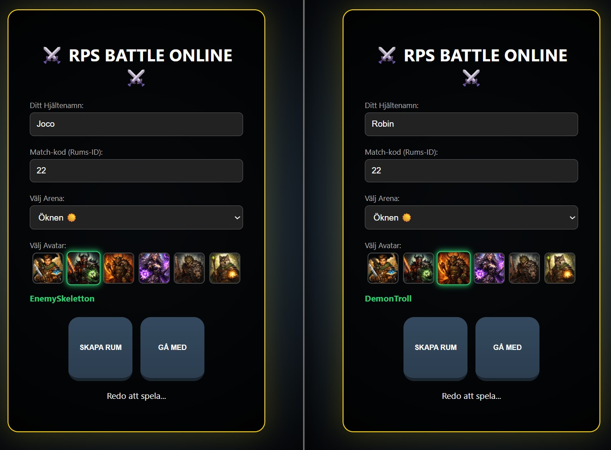
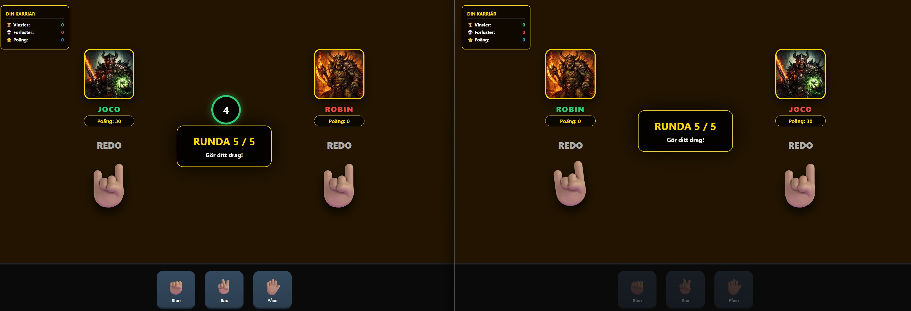
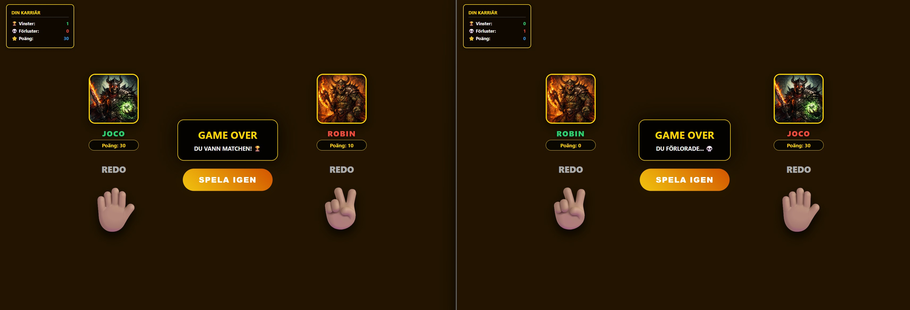

# ⚔️ RPS Online Battle

Ett strategiskt Sten-Sax-Påse-spel i realtid byggt med fokus på multiplayer-upplevelse och dynamisk spelmekanik. Utmana vänner i realtid i olika episka arenor, välj din hjälte och klättra i karriärstegen.

## 🔗 Spela Här
**[Klicka här för att öppna spelet!](https://jocoborghol.github.io/RPS-Online-Battle/)**

## 📸 Screenshots

| 1. Lobby & Inställningar | 2. Gameplay (Battle) | 3. Matchavslut (Resultat) |
| :---: | :---: | :---: |
|  |  |  |

> *Gränssnittet visar lobbyn för matchuppsättning, pågående strid med timer och det slutgiltiga resultatet med möjlighet till revansch.*

## 🚀 Funktioner

* **Ingen Installation:** Spelet körs direkt i webbläsaren via GitHub Pages.
* **Realtime Multiplayer:** Spela mot vänner i realtid tack vare synkronisering med Firebase Realtime Database.
* **Dynamiska Arenor:** Välj mellan olika slagfält som Lavahavet, Isberget eller Öknen.
* **Hjälteval:** Anpassa din profil med unika avatarer och hjältenamn.
* **Karriärstatistik:** Systemet sparar dina vinster, förluster och poäng löpande.
* **Intensiv Timer:** Varje runda har en 10-sekunders timer för att säkerställa ett snabbt speltempo.

## 🛠 Teknikstack

* **Frontend:** Semantisk HTML5, CSS3 (med animationer) och modern JavaScript (ES6+).
* **Backend:** [Firebase Realtime Database](https://firebase.google.com/docs/database) för datalagring och realtidskommunikation.
* **Hosting:** GitHub Pages för omedelbar tillgänglighet.

## 🕹 Hur man spelar

1.  Öppna [spelets URL](https://jocoborghol.github.io/RPS-Online-Battle/).
2.  Ange ett hjältenamn och välj en unik match-kod (t.ex. "22").
3.  Välj din arena och avatar.
4.  Klicka på **SKAPA RUM** eller **GÅ MED**.
5.  Gör ditt drag inom 10 sekunder. Först till 5 ronder vinner hela matchen!.